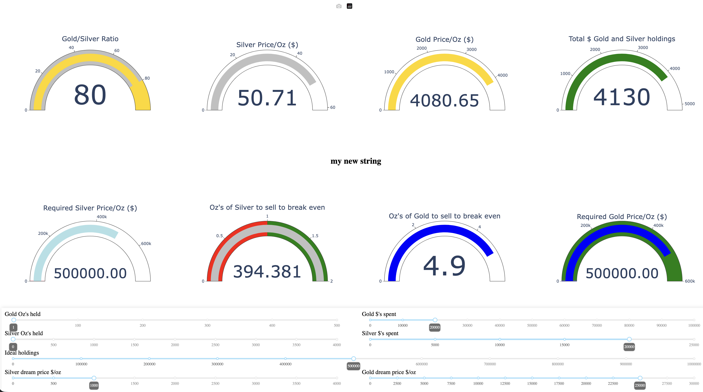

# What does this dashboard do

Every minute we go out to

    https://data-asg.goldprice.org/dbXRates/USD

to fetch the current gold and silver prices.

We can set the environmental variables:

* goldholdings
* silverholdings
* myholdingsstring

to determine the value of our holdings.

We can also use the sliders to calculate the value of our holdings if the price of gold or silver changes.

